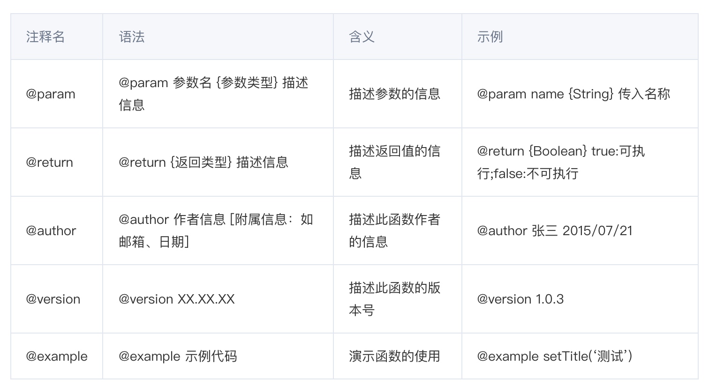

# 规范

## 代码注释规范

### 函数多行注释

常用注释关键字


```javascript
/**
 * 合并Grid的行
 * @param grid {Ext.Grid.Panel} 需要合并的Grid
 * @param cols {Array} 需要合并列的Index(序号)数组；从0开始计数，序号也包含。
 * @param isAllSome {Boolean} ：是否2个tr的cols必须完成一样才能进行合并。true：完成一样；false(默认)：不完全一样
 * @return void
 * @author polk6 2015/07/21
 * @example
 * _________________                             _________________
 * |  年龄 |  姓名 |                             |  年龄 |  姓名 |
 * -----------------      mergeCells(grid,[0])   -----------------
 * |  18   |  张三 |              =>             |       |  张三 |
 * -----------------                             -  18   ---------
 * |  18   |  王五 |                             |       |  王五 |
 * -----------------                             -----------------
 */
function mergeCells(
  grid: Ext.Grid.Panel,
  cols: Number[],
  isAllSome: boolean = false
) {
  // Do Something
}
```

参数和返回值类型 Type：string、boolean、number、object、array、function

### 变量注释

```javascript
/**
 * @var {object}
 * @desc 变量定义
 * @property {string} a 属性a
 * @property {string} b 属性b
 */
var foo = {
  a: "a",
  b: "b",
};
```

### 常量注释

```javascript
/**
 * @constant {string}
 * @default #000 默认值
 * @desc 常量定义
 */
const COLOR_WHITE = "#fff";
```

### 枚举注释

```javascript
/**
 * @enum {number}
 * @desc cgi常见的返回码
 */
var RETCODE = {
  /**
   * @desc 未登录
   */
  NOT_LOGIN: 100000,
  /**
   * @desc 参数错误
   */
  PARAM_ERROR: 100001,
  /**
   * @type {string}
   * @desc 未知错误
   */
  UNKOWN_ERROR: "unkown",
};
```

### 参考资料

[规范 JavaScript 注释](https://cloud.tencent.com/developer/article/1651333)
