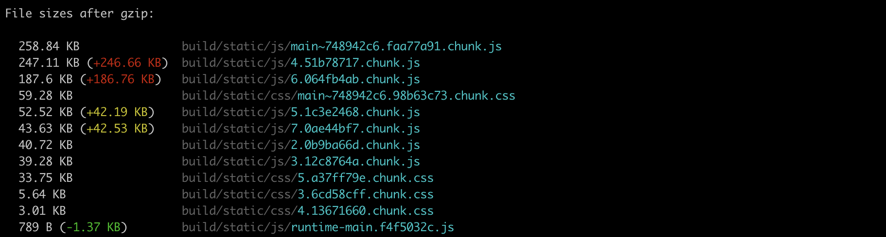
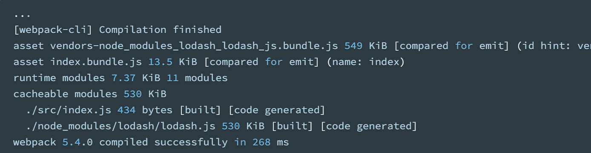
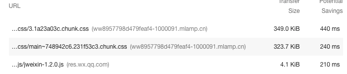

# 性能优化的工具和方法

性能优化是前端开发中一个非常重要的组成部分，比如 如何更好地进行网络传输，如何优化浏览器渲染过程，那么怎么来定位项目中存在的问题呢？

Chrome DevTools 给我们提供了 2 种常用方式：

- Lighthouse：可以对页面进行性能评分，同时还会给出一些优化建议
- Performance：分析运行时性能。比如页面的响应、动画和空闲阶段。

React 项目还可以利用

- Profiler：官方提供的性能分析插件，收集每个组件渲染的耗时，用于分析识别出 React 应用中的性能瓶颈

在隐身模式下打开谷歌浏览器。隐身模式可确保 Chrome 以干净的状态运行。例如，如果您安装了很多扩展，这些扩展可能会在您的性能测量中产生干扰

## Lighthouse

根据 Google Developers Docs 上的描述

> Lighthouse 是一种开源的自动化工具，用于提高网页质量。你可以在任何网页上运行它。它能够针对性能、可访问性、渐进式 Web 应用等进行审核。
> 你可以在 Chrome DevTools 中从命令行运行 Lighthouse。当你向 Lighthouse 提供了一个 URL 来进行审核时，它会针对该页面运行一系列审核，然后生成一个关于该页面执行情况的报告。这份报告可以作为如何改进页面的指标。每次审核都会产生一份参考文档，解释了这些审核为什么重要，以及如何解决等内容。

目前测试项包括页面性能、PWA、可访问性（无障碍）、最佳实践、SEO。
Lighthouse 会对各个测试项的结果打分，并给出优化建议，这些打分标准和优化建议可以视为 Google 的网页最佳实践。

步骤：

1. 单击 Lighthouse 选项卡。它可能隐藏在“更多面板” 按钮后面
2. 将您的 Lighthouse 配置设置与下图中的设置相匹配


以下是对不同选项的解释：

- device（设备）：设置为 Mobile 会更改用户代理字符串并模拟移动视口。设置为桌面几乎只是禁用移动更改。
- categories(种类)：禁用某个类别会阻止审核面板运行这些审核，并将这些审核从您的报告中排除。如果您想查看其他类别提供的推荐类型，您可以启用其他类别。禁用类别会稍微加快审核过程。

单击 `生成报告`，10 到 30 秒后，审核面板会向您显示站点性能报告。

### 以群侧边栏首页为例，通过 Lighthouse 对页面进行性能评分


报告顶部的数字是网站的整体性能得分。稍后，当您对代码进行更改时，您应该会看到这个数字上升。更高的分数意味着更好的性能。

该指标部分提供了网站的性能的定量测量。每个指标都提供了对性能不同方面的洞察。例如，First Contentful Paint 会告诉您内容何时首次绘制到屏幕上，这是用户感知页面加载的一个重要里程碑，而 Time To Interactive 标志着页面似乎已准备好处理用户交互的时间点。

### opportunities（优化建议）

在 opportunities 部分提供了关于如何提高这个特定页面的加载性能的具体建议。


### 根据 opportunities 实践

#### 一、Enable text compression（压缩文本）

> Text-based resources should be served with compression (gzip, deflate or brotli) to minimize total network bytes.
> 文本压缩：在通过网络发送文本文件之前减小或压缩文本文件的大小。有点像您如何在通过电子邮件发送文件夹之前压缩文件夹以减小其大小。

单击[了解更多](https://web.dev/uses-text-compression/?utm_source=lighthouse&utm_medium=devtools) ，以查看有关 opportunity 为何重要的文档，以及有关如何修复它的具体建议。


**在启用压缩之前，您可以通过以下几种方法手动检查文本资源是否已压缩**

1. 单击 network 选项卡
2. 单击 use large request rows 使用大请求行。网络请求表中行的高度增加
3. 如果在网络请求表中没有看到 Size 列，请单击表标题，然后选择 Size

每个大小单元格显示两个值。最高值是下载资源的大小。底部值是未压缩资源的大小。如果这两个值相同，则资源在通过网络发送时不会被压缩。


**您还可以通过检查资源的 HTTP 标头来检查压缩：**

1. 单击 chunk.js。
2. 单击标题选项卡。
3. 在 response header 部分搜索 content-encoding 标题。没有找到，这意味着 bundle.js 没有被压缩。当资源被压缩，content-encoding 一般设置为 gzip，deflate 或 br。有关这些值的解释，请参阅指令。


**方法：**

1. Install gzipper package (https://www.npmjs.com/package/gzipper)
   `gzipper compress [options] <path> [outputPath]`
2. Modify build command like this in package.json

```json
- "build": "node scripts/build.js"
+ "build": "node scripts/build.js && gzipper compress --verbose ./build"
```

运行 `npm run build` 后


build your project you will get both gzip and regular file. It is up to you to make server to serve gzip instead of regular file. If you are using nginx you have to setup your server in nginx.conf file as below

```
server {
    # Gzip Settings
    gzip on;
    gzip_static on; # allows pre-serving of .gz file if it exists
    gzip_disable "msie6"; # Disable for user-agent Internet explorer 6. Not supported.
    gzip_proxied any; # enable gzip for all proxied requests
    gzip_buffers 16 8k; # number and size of buffers to compress a response
    gzip_http_version 1.1;
    gzip_min_length 256; # Only gzip files of size in bytes
    gzip_types text/plain text/css text/html application/javascript application/json application/x-javascript text/xml application/xml application/xml+rss text/javascript application/vnd.ms-fontobject application/x-font-ttf font/opentype image/svg+xml image/x-icon;
    gunzip on; # Uncompress on the fly
    listen       80;
    server_name  localhost;

    ...
}
```

参考资料：
[解决方案参照](https://stackoverflow.com/questions/55704772/how-to-compress-build-with-without-ejecting-create-react-app-also-include-compr)
[Nginx 的 Gzip 功能](https://www.cnblogs.com/54chensongxia/p/13355054.html)

#### 二、Reduce unused JavaScript

> Reduce unused JavaScript and defer loading scripts until they are required to decrease bytes consumed by network activity.

**React 项目，用 React.lazy() 结合 Suspense**

> 参见 React 官方文档：
> not server-side rendering： React.lazy() + Suspense with a defined fallback, Otherwise, code-split using a third-party library such as loadable-components.

React.lazy() 和 Suspense 配合使用

```javascript
import React, { Suspense, lazy } from "react";
import { BrowserRouter as Router, Route, Switch } from "react-router-dom";

const Home = lazy(() => import("./routes/Home"));
const About = lazy(() => import("./routes/About"));

const App = () => (
  <Router>
    <Suspense fallback={<div>Loading...</div>}>
      <Switch>
        <Route exact path="/" component={Home} />
        <Route path="/about" component={About} />
      </Switch>
    </Suspense>
  </Router>
);
```

参考资料：
[React Docs on code splitting](https://reactjs.org/docs/code-splitting.html#route-based-code-splitting)

**Build tool for support for Code Splitting**

代码分割是由诸如 Webpack，Rollup 和 Browserify（factor-bundle）这类打包器支持的一项技术，能够创建多个包并在运行时动态加载。
可以避免加载用户永远不需要的代码，并在初始加载的时候减少所需加载的代码量

webpack 的常见做法：

- **入口起点：在 entry 里配置多个入口，使用 entry 配置手动地分离代码。比如分离业务代码和第三方库（ vendor ）**

```javascript
module.exports = {
  entry: {
    app: path.resolve(__dirname, "src/index.js"),
    vendor: path.resolve(__dirname, "src/vendor.js"),
  },
};
```

- **防止重复：使用 Entry dependencies 或者 SplitChunksPlugin 去重和分离 chunk**

问题：以 index.js 为例，——部分的修改意味着重新下载所有的文件

所以为什么不把每一个 npm 包都分割为单独的文件呢？
做起来非常简单，利用 Webpack 的 splitChunks，让我们把我们的 react，lodash 等分离为不同的文件

splitChunks 配置分离规则如下：

```javascript
module.exports = {
  entry: {
    app: path.resolve(__dirname, "src/index.js"),
  },

  output: {
    path: path.resolve(__dirname, "dist"),
    filename: "[name].[contenthash].js",
  },
  optimization: {
    splitChunks: {
      // 表示选择哪些 chunks 进行分割，可选值有：async，initial和all
      chunks: "all",
      // 表示加载入口文件时，并行请求的最大数目。默认为3。
      maxInitialRequests: 3,
      // 表示新分离出的chunk必须大于等于minSize，默认为30000，约30kb。
      minSize: 30000,
      /*
      cacheGroups是我们用来制定规则告诉 Webpack 应该如何组织 chunks 到打包输出文件的地方。
      cacheGroups 下可以配置多个组，每个组根据test设置条件，符合test条件的模块，就分配到该组。
      模块可以被多个组引用，但最终会根据priority来决定打包到哪个组中。

      通常情况下，只需要为输出文件的 name定义一个字符串。但是把name定义为一个函数（当文件被解析时会被调用）。在函数中会根据 module 的路径返回包的名称。结果就是，对于每一个包都会得到一个单独的文件，比如npm.react-dom.899sadfhj4.js

    */
      cacheGroups: {
        atm: {
          test: "/antd-mobile/",
          priority: 1,
        },
        milo: {
          test: /milo-ui/,
          priority: 1,
        },
        vendor: {
          test: /[\\/]node_modules[\\/]/,
          name(module) {
            // get the name. E.g. node_modules/packageName/not/this/part.js
            // or node_modules/packageName
            const packageName = module.context.match(
              /[\\/]node_modules[\\/](.*?)([\\/]|$)/
            )[1];

            // npm package names are URL-safe, but some servers don't like @ symbols
            return `npm.${packageName.replace("@", "")}`;
          },
          reuseExistingChunk: true,
        },
        // 将两个以上的chunk所共享的模块打包至default组
        default: {
          minChunks: 2,
          reuseExistingChunk: true,
        },
      },
    },
  },
};
```

修改前打包后的 js 文件目录：



修改后打包后的 js 文件目录：


- **动态导入：通过模块的内联函数调用来分离代码**
  > kindly remind: 这里只是一个示例，lodash 可以用支持模块化导入的 lodash-es 代替

示例：
我们不再使用 statically import(静态导入) lodash，而是通过 dynamic import(动态导入) 来分离出一个 chunk：

```javascript
async function getComponent() {
  const element = document.createElement("div");
  const { default: _ } = await import("lodash");
  element.innerHTML = _.join(["Hello", "webpack"], " ");

  return element;
}

getComponent().then((component) => {
  document.body.appendChild(component);
});
```

在修改后，会分离出一个独立的 lodash 文件：


- **Unused Code Elimination & Unused Imported Code**

利用 webpack 的 [Tree Shaking](https://webpack.js.org/guides/tree-shaking) ，去除 unused code

> 参见 webpack4 文档：
> Tree shaking is a term commonly used in the JavaScript context for dead-code elimination. It relies on the static structure of ES2015 module syntax, i.e. import and export. The name and concept have been popularized by the ES2015 module bundler rollup.

> The webpack 2 release came with built-in support for ES2015 modules (alias harmony modules) as well as unused module export detection. The new webpack 4 release expands on this capability with a way to provide hints to the compiler via the "sideEffects" package.json property to denote which files in your project are "pure" and therefore safe to prune if unused.

```json
{
  "name": "ml-wxwork-assistant",
  "sideEffects": false
}
```

修改后打包后的 js 文件目录：


对比发现有些文件小了一些

参考资料：
[Remove unused JavaScript](https://web.dev/unused-javascript/)

#### 三、Eliminate render-blocking resources

> A render-blocking resource is an external JavaScript or CSS file that the browser must download, parse, and execute before it can show the page. The goal is to only run the core CSS and JavaScript code that is required to display the page properly.

The first task, then, is to find code that doesn't need to be executed on page load.

阻塞的资源如下：


1. 按 Command+Shift+P (Mac) 或 Control+Shift+P（Windows、Linux、Chrome OS）打开命令菜单，开始输入 Coverage，然后选择 Show Coverage。

2. 切换到 Coverage 面板

3. 单击重新加载。从下图中能看出，前面几个文件 大部分的内容 没有被使用。
   

4. 单击某一行。DevTools 在 Sources 面板中打开文件。如果一行代码旁边有一个绿色条，它就会被执行。红色条表示它没有被执行，并且在页面加载时绝对不需要。


Coverage 选项卡可以帮助您逐行分析代码，并且只发送页面加载所需的代码。

解决办法：
可以通过在页面加载期间仅传送关键代码，然后延迟加载其他所有代码来加速页面加载。

- 您不太可能找到可以完全删除的脚本，但您经常会发现许多脚本不需要在页面加载期间请求，而是可以异步请求。请参阅使用 async 或 defer。

针对 jweixin，因为一进入页面，就需要调用企业微信的注册等功能，是否可以这样用呢？

```javascript
<script src="//res.wx.qq.com/open/js/jweixin-1.2.0.js" defer></script>
```

可以在 test 环境测试，为了不污染测试环境，以后再验证此 js 文件 defer 的影响，大家也可以思考一下

- 如果您使用的是框架，请检查它是否具有生产模式。此模式可能会使用诸如 tree shaking 之类的功能，以消除阻塞关键渲染的不必要代码。修改后结果如图：
  

在 script 元素中

- 设置 defer 属性（只适用于外部脚本文件）：告诉浏览器立即下载，但延迟执行
- 设置 async 属性：不让页面等待脚本下载和执行，从而异步加载页面其他内容。

#### 四.本项目中优化的其他方案


- 去除 moment.js ，换成其他可以按需加载的时间库
- 在 `@mlamp/milo-ui` 中去除`moment`依赖 和 按需加载`@ant-design/icons`

```javascript
import { Button } from 'antd';

// tree-shaking supported
- import { Icon } from 'antd';
+ import { SmileOutlined } from '@ant-design/icons';

  const Demo = () => (
    <div>
-     <Icon type="smile" />
+     <SmileOutlined />
      <Button icon={<SmileOutlined />} />
    </div>
  );

  // or directly import
  import SmileOutlined from '@ant-design/icons/SmileOutlined';
```

### 诊断（Diagnostics）

#### 一、Serve static assets with an efficient cache policy

> A long cache lifetime can speed up repeat visits to your page. [Learn more](https://web.dev/uses-long-cache-ttl/?utm_source=lighthouse&utm_medium=devtools).


浏览器中的 cache 的三种属性

1. Cache-Control:
   no-cache: 代表档案不会被浏览器记住，每次 refresh 后都会重新与 server 要一次资料
   max-age: 以秒为单位，当超过 cache 时间，refresh 后会重新与 server 要一次资料
2. Expires
   Expires: cache 过期失效的设定，在还没过期前，使用者怎么 refresh 都不会重新与 server 要一次资料。这的确会让 server 压力大大的下降，但大家或许会看出个问题，假设我设定了 365 天的 Expires，当 server 端的档案更新但使用者却要一年之后才会更新怎么办？这时第三个主角就要出现了，我们继续看下去！
3. Last-Modified
   当设定此参数之后，每次使用者 refresh 页面后，其实都会偷偷地向 server 下一个请求(非常非常小)，基本上就是确定档案有没有被更新过，如果没有就什么都不做，如果有就更新！

解决办法：通过在 nginx 中设定缓存参数

```
  location /static {
    # 如果想要缓存所有 static 下的档案(css, js 档案都在其中)
    alias /static;
    # max-age 单位为秒数，在此设定 365 天
    add_header Cache-Control "public, max-age=31536000";
    # expires 10d 代表着 10 天就会过期，重新要资料。
    expires 10d;
  }
```

#### 二、Avoid enormous network payloads

修改了 webpack 配置后，发现此问题也消失了

#### 三、Avoid an excessive DOM size

文件过大


### Passed audits


可以大致过一下需要注意的内容，作为参考，在以后的开发工作中注意
