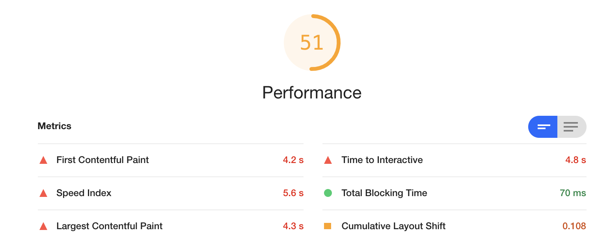
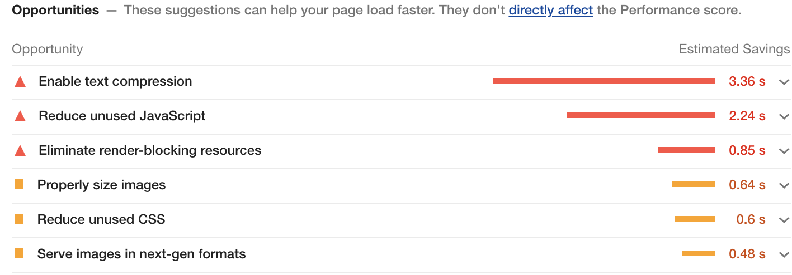
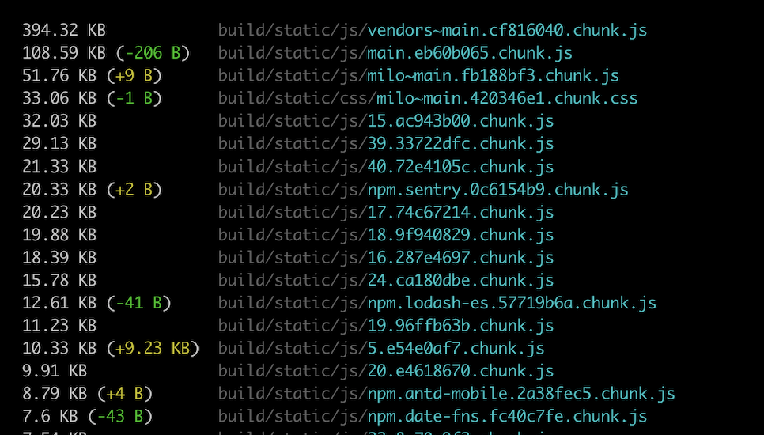
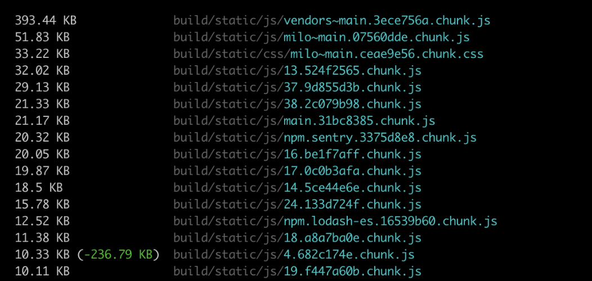
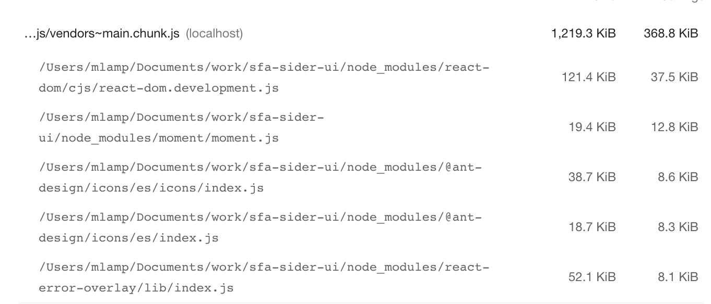

# 项目优化

性能优化是前端开发一个非常重要的组成部分，如何更好地进行网络传输，如何优化浏览器渲染过程，来定位项目中存在的问题。Chrome DevTools 给我们提供了 2 种常用方式 Lighthouse 和 Performance。Lighthouse 可以对页面进行性能评分，同时，还会给我们提供一些优化建议。而 Performance 提供了非常多的运行时数据，能让我们看到更多细节数据。

## Lighthouse

根据 Google Developers Docs 上的描述

> Lighthouse 是一种开源的自动化工具，用于提高网页质量。你可以在任何网页上运行它。它能够针对性能、可访问性、渐进式 Web 应用等进行审核。
> 你可以在 Chrome DevTools 中从命令行运行 Lighthouse。当你向 Lighthouse 提供了一个 URL 来进行审核时，它会针对该页面运行一系列审核，然后生成一个关于该页面执行情况的报告。这份报告可以作为如何改进页面的指标。每次审核都会产生一份参考文档，解释了这些审核为什么重要，以及如何解决等内容。

目前测试项包括页面性能、PWA、可访问性（无障碍）、最佳实践、SEO。
Lighthouse 会对各个测试项的结果打分，并给出优化建议，这些打分标准和优化建议可以视为 Google 的网页最佳实践。

### 1.以本地环境群侧边栏首页为例，通过 Lighthouse 对页面进行性能评分



### 2.优化建议如下



### 3.实践

> Opportunities - These suggestions can help your page load faster. They don't directly affect the Performance score.

#### 1. Reduce unused JavaScript

Reduce unused JavaScript and defer loading scripts until they are required to decrease bytes consumed by network activity.

**1).React 项目，用 React.lazy() 结合 Suspense**

> not server-side rendering： React.lazy() + Suspense with a defined fallback
> Otherwise, code-split using a third-party library such as loadable-components.

```javascript
import React, { Suspense, lazy } from "react";
import { BrowserRouter as Router, Route, Switch } from "react-router-dom";

const Home = lazy(() => import("./routes/Home"));
const About = lazy(() => import("./routes/About"));

const App = () => (
  <Router>
    <Suspense fallback={<div>Loading...</div>}>
      <Switch>
        <Route exact path="/" component={Home} />
        <Route path="/about" component={About} />
      </Switch>
    </Suspense>
  </Router>
);
```

参考资料：
[React Docs on code splitting](https://reactjs.org/docs/code-splitting.html#route-based-code-splitting)

**2).Build tool for support for Code Splitting**

代码分割是由诸如 Webpack，Rollup 和 Browserify（factor-bundle）这类打包器支持的一项技术，能够创建多个包并在运行时动态加载。
可以避免加载用户永远不需要的代码，并在初始加载的时候减少所需加载的代码量。

webpack 常见做法：

- **入口起点：在 entry 里配置多个入口，使用 entry 配置手动地分离代码。比如分离业务代码和第三方库（ vendor ）**

```javascript
module.exports = {
  entry: {
    app: path.resolve(__dirname, "src/index.js"),
    vendor: path.resolve(__dirname, "src/vendor.js"),
  },
};
```

- **防止重复：使用 Entry dependencies 或者 SplitChunksPlugin 去重和分离 chunk**
  app.js 的问题：——部分的修改意味着重新下载所有的文件

所以为什么不把每一个 npm 包都分割为单独的文件呢？
做起来非常简单，利用 Webpack 的 splitChunks，让我们把我们的 react，lodash 等分离为不同的文件

splitChunks 配置分离规则如下：

```javascript
module.exports = {
  entry: {
    app: path.resolve(__dirname, "src/index.js"),
  },

  output: {
    path: path.resolve(__dirname, "dist"),
    filename: "[name].[contenthash].js",
  },
  optimization: {
    splitChunks: {
      // 表示选择哪些 chunks 进行分割，可选值有：async，initial和all
      chunks: "all",
      // 表示加载入口文件时，并行请求的最大数目。默认为3。
      maxInitialRequests: 3,
      // 表示新分离出的chunk必须大于等于minSize，默认为30000，约30kb。
      minSize: 30000,
      /*
      cacheGroups是我们用来制定规则告诉 Webpack 应该如何组织 chunks 到打包输出文件的地方。
      cacheGroups 下可以配置多个组，每个组根据test设置条件，符合test条件的模块，就分配到该组。
      模块可以被多个组引用，但最终会根据priority来决定打包到哪个组中。

      通常情况下，只需要为输出文件的 name定义一个字符串。但是把name定义为一个函数（当文件被解析时会被调用）。在函数中会根据 module 的路径返回包的名称。结果就是，对于每一个包都会得到一个单独的文件，比如npm.react-dom.899sadfhj4.js

    */
      cacheGroups: {
        atm: {
          test: "/antd-mobile/",
          priority: 1,
        },
        milo: {
          test: /milo-ui/,
          priority: 1,
        },
        vendor: {
          test: /[\\/]node_modules[\\/]/,
          name(module) {
            // get the name. E.g. node_modules/packageName/not/this/part.js
            // or node_modules/packageName
            const packageName = module.context.match(
              /[\\/]node_modules[\\/](.*?)([\\/]|$)/
            )[1];

            // npm package names are URL-safe, but some servers don't like @ symbols
            return `npm.${packageName.replace("@", "")}`;
          },
          reuseExistingChunk: true,
        },
        // 将两个以上的chunk所共享的模块打包至default组
        default: {
          minChunks: 2,
          reuseExistingChunk: true,
        },
      },
    },
  },
};
```

修改前打包后的 js 文件目录：


修改后打包后的 js 文件目录：



- **动态导入：通过模块的内联函数调用来分离代码**
  示例：
  我们不再使用 statically import(静态导入) lodash，而是通过 dynamic import(动态导入) 来分离出一个 chunk：

```javascript
async function getComponent() {
  const element = document.createElement("div");
  const { default: _ } = await import("lodash");
  element.innerHTML = _.join(["Hello", "webpack"], " ");

  return element;
}

getComponent().then((component) => {
  document.body.appendChild(component);
});
```

在修改后，会分离出一个独立的 lodash 文件：


#### 2.Unused Code Elimination & Unused Imported Code

利用 webpack 的 [Tree Shaking](https://webpack.js.org/guides/tree-shaking) ，去除 unused code

> the new webpack 4 release expands on this capability with a way to provide hints to the compiler via the "sideEffects" in package.json

```json
{
  "name": "ml-wxwork-assistant",
  "sideEffects": false
}
```

修改后打包后的 js 文件目录：



对比发现有些文件小了一些

参考资料：

[Remove unused JavaScript](https://web.dev/unused-javascript/)

根据Lighthouse的报告，可以看出 moment.js 文件没有按需加载



去除 moment.js ，换成其他可以按需加载的时间库
#### 2. Minify JavaScript
webpack基本配置
#### 3. Eliminate render-blocking resources


**1).Serve static assets with an efficient cache policy**
**2).Avoid enormous network payloads**
**3).Avoid an excessive DOM size**


**四、按照建议优化后性能评分**


## Performance

以群侧边栏首页为例，尝试通过 Performance 来分析出哪些代码影响性能

第一部分：概览
这里最主要是整体的界面渲染的时候，每个时间段执行的事件顺序，通过上图我们就能知道我们每个时间段（精确到毫秒）都做了什么，当鼠标放上去的时候，我们还可以大图的形式去查看我们每个时间段界面的渲染情况，Performance 就会将几个关键指标，诸如页面帧速 (FPS)、CPU 资源消耗、网络请求流量、V8 内存使用量 (堆内存) 等，按照时间顺序做成图表的形式展现出来。

第二部分：性能面板
性能面板主要包括以下几部分
1.Network 这里我们可以直观的看到资源加载的顺序与时长
2.Interactions 用来记录用户交互操作，比如点击鼠标、输入文字、动画等
3.Timings 用来记录一些关键的时间节点在何时产生的数据信息，诸如 FP、FCP、LCP 等
4.Main 是 Performance 工具中比较重要的部分，记录了渲染进程中主线程的执行记录，点击 main 可以看到某个任务执行的具体情况
5.Compositor 合成线程的执行记录，用来记录 html 绘制阶段 (Paint)结束后的图层合成操作
6.Raster 光栅化线程池，用来让 GPU 执行光栅化的任务
7.GPU GPU 进程主线程的执行过程记录，如 可以直观看到何时启动 GPU 加速…
Memory 选项，在勾选后，就会显示该折线图，通过该图可以看出我们在不同的时间段的执行情况。我们可以看到页面中的内存使用的情况，比如 JS Heap(堆)，如果曲线一直在增长，则说明存在内存泄露，如果相当长的一段时间，内存曲线都是没有下降的，这里是有发生内存泄露的可能的。
通过对性能面板各个部分的分析与问题定位，可以更深刻的理解浏览器是如何工作的

第三部分：Summary（性能摘要）
它是一个用来统计在我们检测性能的时间范围内，都做了哪些事情：
Loading ：加载时间
Scripting ：js 计算时间
Rendering ：渲染时间
Painting ：绘制时间
Other ：其他时间
Idle ：浏览器闲置时间

## React Profiler
