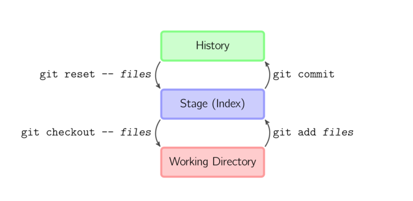
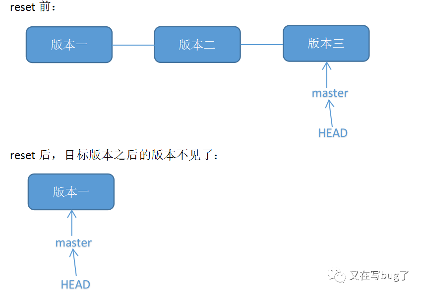
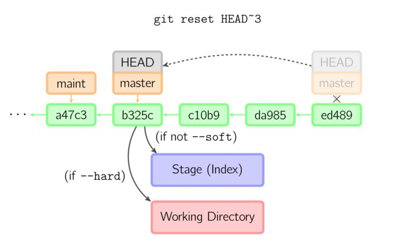
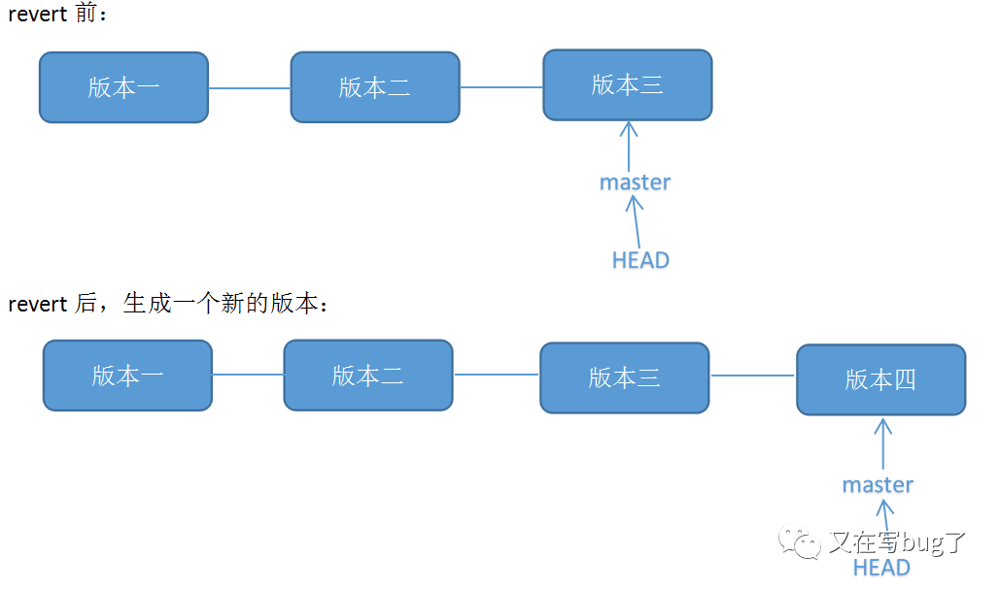

# Git

## 基本概念

- Workspace：工作区
- Index / Stage：暂存区
- Repository：仓库区（或本地仓库）

搞懂了这三个区域，才能更好理解这些 Git 命令是在干什么。

## 版本回退

在 Git 中，用 `HEAD` 表示当前版本，上一个版本就是 `HEAD^`，往上 n 个版本写成 `HEAD~n`。


### 一、reset：

**原理**：修改 HEAD 的位置，即将 HEAD 指向的位置改变为之前存在的某个版本，reset 后目标版本之后的版本不见了，基于本地仓库的文件去覆盖暂存区或工作区的内容

**适用场景**： 如果想恢复到之前某个提交的版本，且那个版本之后提交的版本我们都不要了，就可以用这种方法。

如下图所示：


- --mixed（默认）
  默认的时候，只有暂存区变化

- --hard 参数
  如果使用--hard 参数，那么工作区也会变化

- --soft
  如果使用--soft 参数，那么暂存区和工作区都不会变化



```javascript
// 回退到指定版本
git reset --hard [commit_id]

/*
    *强制提交
    *此时如果用`git push`会报错，因为我们本地库HEAD指向的版本比远程库的要旧
*/
git push -f
```
回退到上一个版本:
`git reset --hard HEAD^`
### 二、revert：

**原理**： git revert 用于“反做”某一个版本，以达到撤销该版本的修改的目的。比如，我们 commit 了三个版本（版本一、版本二、 版本三），突然发现版本二不行（如：有 bug），想要撤销版本二，但又不想影响撤销版本三的提交，就可以用 git revert 命令来反做版本二，生成新的版本四，这个版本四里会保留版本三的东西，但撤销了版本二的东西。

**适用场景**： 想撤销之前的某一版本，但是又想保留该目标版本后面的版本，记录下这整个版本变动的流程。

如下图所示：


```javascript
// 反做
git revert -n <commit_id>

// 提交
git commit -m <msg>

// 提交
git push
```

## 分支管理

通常，合并分支时，如果可能，Git 会用 Fast forward 模式，但这种模式下，删除分支后，会丢掉分支信息。
如果要强制禁用 Fast forward 模式，Git 就会在 merge 时生成一个新的 commit，这样，从分支历史上就可以看出分支信息。

切换分支
`git switch <branch>`

创建并切换分支
`git switch -c <branch>`

合并分支
`git merge --no-ff -m "merge with no-ff" <branch>`

## 远程仓库

查看远程库的信息
`git remote`

查看远程库详细的信息
`git remote -v`

把该分支上的所有本地提交推送到远程库对应的远程分支上
`git push origin <本地分支>`

建立本地分支和远程分支的关联
`git branch --set-upstream <branch> origin/<branch>`

## 常用命令

### git stash

把当前工作现场“储藏”起来
`git stash`

stash 列表
`git stash list`

恢复:

- `git stash apply`: 恢复后，stash 内容不删除
- `git stash pop`: 恢复的同时把 stash 内容也删了
- `git stash apply stash@{0}`: 恢复指定的 stash

### git cherry-pick

复制一个特定的提交到当前分支
`git cherry-pick <commit_id>`

### git reflog

记录每一次命令,可以回到未来
`git reflog`

## 参考资料

[说说 Git reset 与 revert 的故事](https://zhuanlan.zhihu.com/p/32412959)
[Git恢复版本reset、revert](https://mp.weixin.qq.com/s?src=11&timestamp=1627376793&ver=3216&signature=ZuuFdStq4Wy0SK*ite4gqayr3mk6qeTadanKDyzdh2zEJZTjzBclXHjOEMtKrJtEt9DwtNOvBkQNiL6pM9*kFf-zv1flHxkwMN*0owKFnvHuWfVUodJywB319knJYeaZ&new=1)
